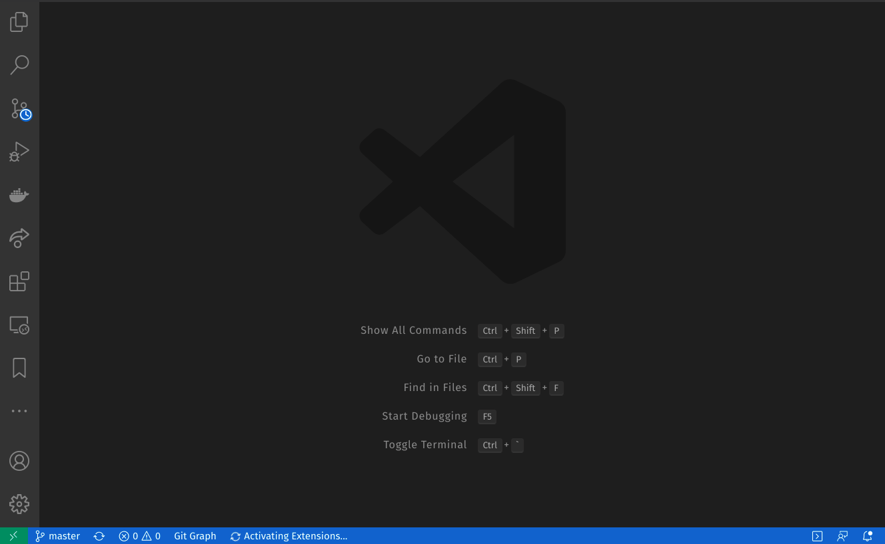
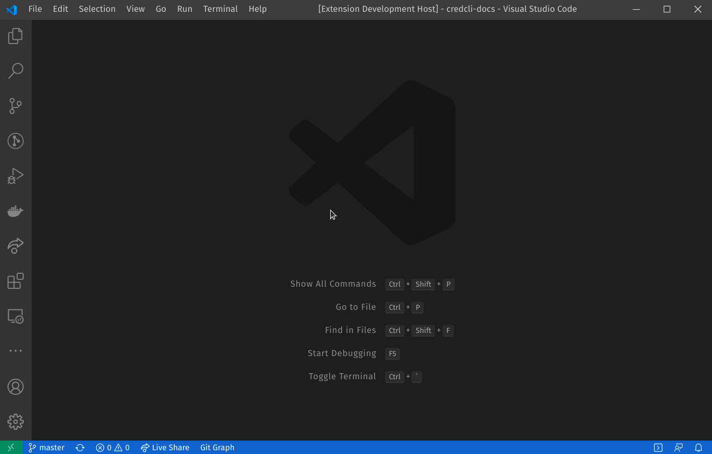

# Quizifer

A vscode extension which focus on "consistently" learning a language.

## Question of the day (QOTD)

- Its dead simple, just one question per day.
- You'll get a notification once a day when you start you're vscode.

    

- Or you can always trigger from `command pallete`

    

- And remember

    

### Credits

### Javascript questions

- [lydiahallie](https://github.com/lydiahallie/javascript-questions)