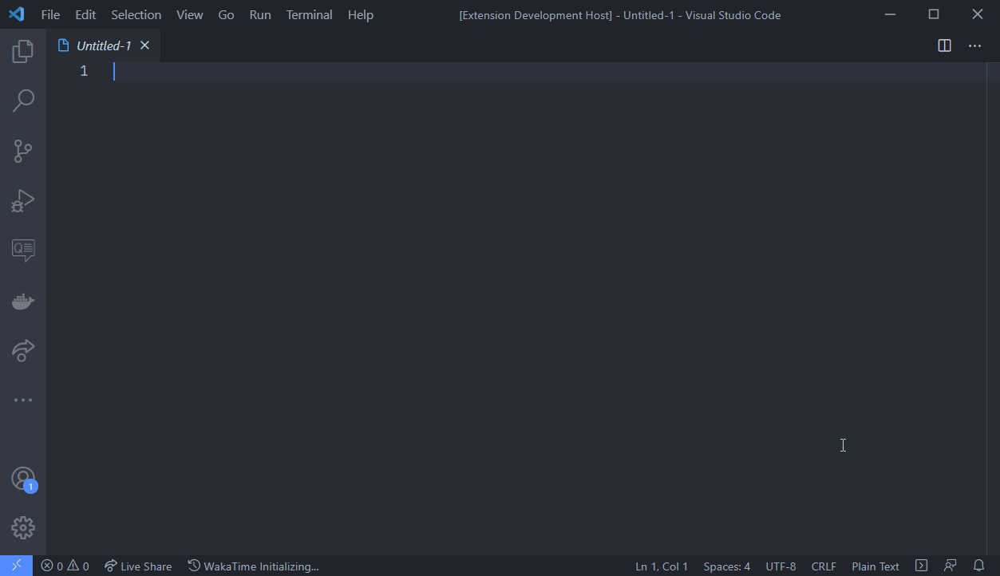
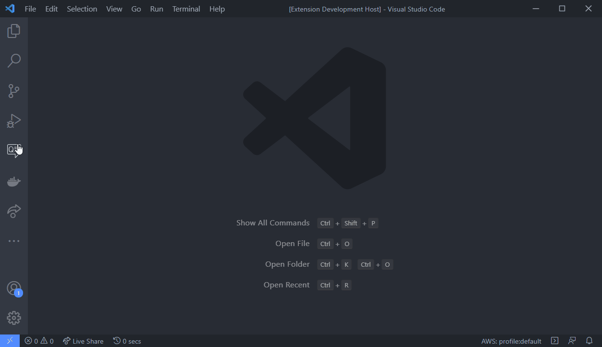
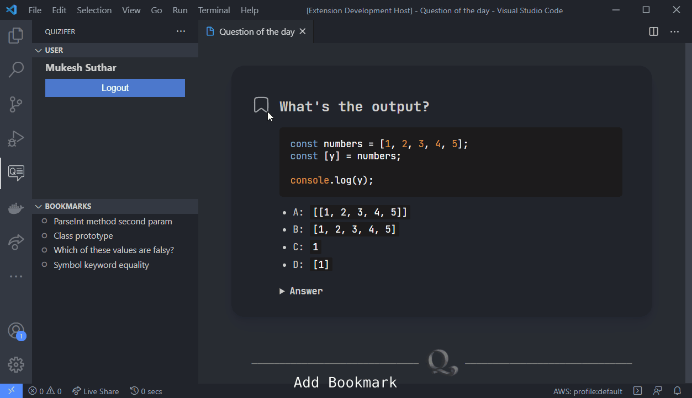

# Quizifer
Vscode extension for Javascript learners.

> The concept is simple, solve one javascript question a day!

## Features

#### *Reminds you everyday.*
Quizifer picks one tricky question a day and notifies you when you're using vscode.
 

#### *Github Authentication*
Login to use below bookmark feature

#### *Bookmarks*
- Found a question interesting? **Bookmark** it.
- Want to give your own caption? **Edit** it.
- Prep time? **Browse** your favourite questions.
- Bookmarked a way easy question for you? **Delete** it.

#### And remember

### Credits

- Special Thanks to [lydiahallie](https://github.com/lydiahallie/javascript-questions) for javascript questions